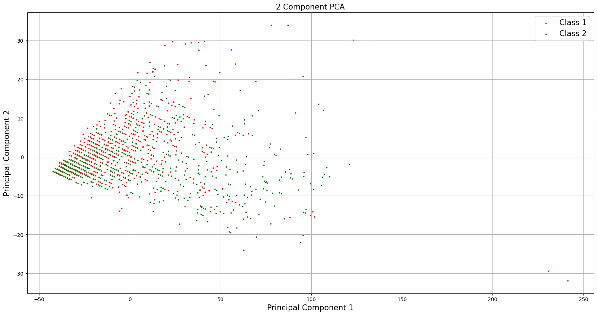
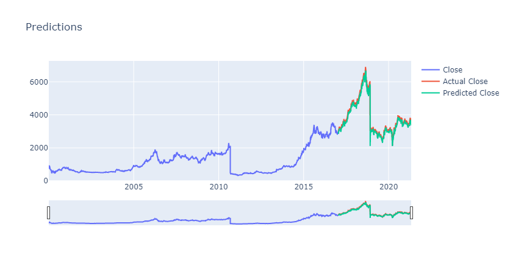

# **My Portfolio**

# Project 1: [Data Analysis of Red Wine](https://github.com/hansie23/data-analysis-of-red-wine)
* This code project is focused on the analysis and classification of red wine quality based on its chemical properties primarily using logistic regression.
* Used Python, Numpy, Pandas, Matplotlib, Seaborn and Scikit-Learn
* Found multi-colinearity in the data. Generated a 2-component PCA projection and visualization
* Trained and tested a logistic regression model gaining 98% accuracy
* Provided insights into how different features affect model performance and demonstrated techniques for visualizing and interpreting results.
* Covered essential steps in machine learning workflows, including data pre-processing, exploration, model training, evaluation, and feature selection

# Project 2 (Part 1): [Dog Breed Prediction Notebook](https://github.com/hansie23/dog-breed-prediction-notebook)
* Used Numpy, Pandas, Matplotlob, Scikit-learn, Tensorflow, Tensorflow Hub
* Turned images to tensors and then converted the data into batches
* Used the neural network model MobileNet V2 from Tensorflow Hub
* Created callbacks for Tensorboard and early stopping
* The model takes dog image as input and give the predicted dog breed as output.

# Project 2 (Part 2): [Dog Breed Prediction Webapp](https://github.com/hansie23/dog-breed-prediction-webapp)
* Used Flask, Python, HTML, CSS, Numpy, Heroku and Tensorflow
* Created a client facing web app to interact with the dog breed prediction model
* Created flask API for preprocessing and prediction of a dog image given as input
* [https://dogbreedprediction-webapp.herokuapp.com/](https://dogbreedprediction-webapp.herokuapp.com/) (might take a bit to load first
time since free Heroku web dyno sleeps after 30 minutes of no web traffic)

# Project 3: [Stock Price Prediction](https://github.com/hansie23/stock-prediction)
* Used Pandas, Numpy, Keras, Scikit-learn, Plotly, Matplotlib and Streamlit
* Designed a deep neural network using LSTM to predict the stock price

# Project 4: [Brain Tumor Segmentation using U-Net Model](#)
* **Objective:** Developed a deep learning model for automatic segmentation of brain tumors from MRI images using the U-Net architecture.
* **Technologies Used:** Python, TensorFlow, Keras, NumPy, OpenCV, PIL, Matplotlib.
* **Data Preprocessing:** Preprocessed a dataset of MRI images and corresponding masks, including resizing, normalization, and augmentation to enhance model robustness.
* **Model Architecture:** Implemented a U-Net convolutional neural network comprising encoder and decoder pathways for feature extraction and segmentation.
* **Training and Evaluation:** Trained the model using Adam optimizer and binary cross-entropy loss, evaluated performance metrics including accuracy, dice coefficient, and Jaccard index.
* **Model Interpretability:** Utilized Gradient-weighted Class Activation Mapping (Grad-CAM) to visualize model decisions and interpret the importance of different features in segmentation.
* **Result Visualization:** Generated visualizations of model predictions and ground truth masks for qualitative assessment of segmentation accuracy.
* **Outcome:** Achieved promising results in tumor segmentation, demonstrating potential for clinical application in medical image analysis and contributing to advancements in healthcare technology.
