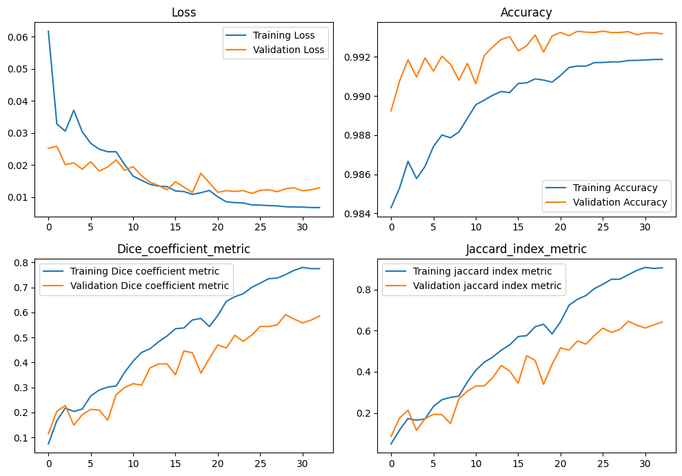

# **My Portfolio**

# Project 1: [Brain Tumor Segmentation](https://hansie23-brain-tumor-segmentation.hf.space)
* **Objective:** Developed a deep learning model for automatic segmentation of brain tumors from MRI images using the U-Net architecture.
* **Technologies Used:** Python, TensorFlow, Keras, NumPy, OpenCV, PIL, Matplotlib.
* **Data Preprocessing:** Preprocessed a dataset of MRI images and corresponding masks, including resizing, normalization, and augmentation to enhance model robustness.
* **Model Architecture:** Implemented a U-Net convolutional neural network comprising encoder and decoder pathways for feature extraction and segmentation.
* **Training and Evaluation:** Trained the model using Adam optimizer and binary cross-entropy loss, evaluated performance metrics including accuracy, dice coefficient, and Jaccard index.
* **Model Interpretability:** Utilized Gradient-weighted Class Activation Mapping (Grad-CAM) to visualize model decisions and interpret the importance of different features in segmentation.
* **Result Visualization:** Generated visualizations of model predictions and ground truth masks for qualitative assessment of segmentation accuracy.
* **Deployment:** * Deployed the model as a web app using Streamlit.
* **Outcome:** Achieved promising results in tumor segmentation, demonstrating potential for clinical application in medical image analysis and contributing to advancements in healthcare technology.

# Project 2: [Dog Breed Prediction](https://hansie23-dog-breed-classifier.hf.space)
* **Objective:** Developed a machine learning model to classify dog breeds from images using TensorFlow.
* **Technologies Used:** Python, TensorFlow, Keras, NumPy, Pandas, Matplotlib, Streamlit.
* **Data Preprocessing:**
  * Sourced from Kaggle’s Dog Breed Identification challenge.
  * Contains thousands of labeled images categorized into 120 dog breeds.
  * Applied image augmentation techniques (rotation, flipping, zooming, shifting) to enhance model generalization.
  * Utilized batch processing for efficient memory usage and training optimization.
* **Model Architecture:** Leveraged transfer learning using the MobileNet_V2 model (https://tfhub.dev/google/imagenet/mobilenet_v2_130_224/classification/5).
* **Training:** 
  * Trained the model using the augmented dataset.
  * Used categorical cross-entropy loss function and Adam optimizer.
  * Monitored performance on a validation set for hyperparameter tuning and overfitting prevention.
* **Evaluation:** Evaluated model performance on a separate test set and using a custom function to evaluate the predicted dog breed with the actual dog breed.
* **Result:** * High accuracy in classifying dog breeds and effective generalization to new, unseen images due to image augmentation.
* **Deployment:** * Deployed the model as a web app using Streamlit.
* **Outcome:** * Demonstrated the potential of transfer learning in image classification tasks with numerous categories. Gained experience in data preprocessing, image processing and transfer learning.

# Project 5: [Stock Price Prediction](https://github.com/hansie23/stock-prediction)
* Used Pandas, Numpy, Keras, Scikit-learn, Plotly, Matplotlib and Streamlit
* Designed a deep neural network using LSTM to predict the stock price

